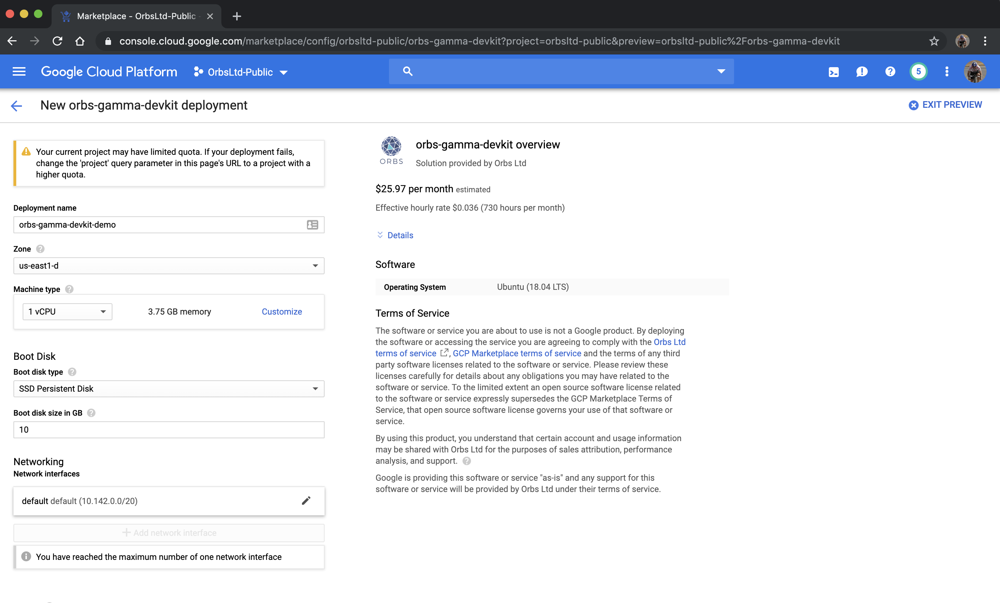
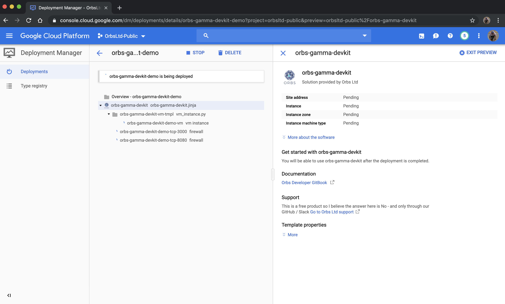

# Google Cloud Launcher

## Deploying
First off we're going to deploy an Orbs development kit. 
The kit consists of:
* Gamma server - Our development local blockchain which will store our data and answer our calls)
* Gamma CLI - The CLI allows us to easily deploy contracts onto the blockchain and perform calls against our deployed contract.
* Prism - Orbs' block explorer which essentially provides visibility into blocks and transactions which have been registered on our network.

Deploying is really easy with Cloud Launcher.
   Simply go to https://console.cloud.google.com/launcher/details/orbsltd-public/orbs-gamma-devkit

Click "Launch on Compute Engine"

You can take the default settings or customize them.  When complete click "Deploy"

That's it!  Your development kit is now deploying.

## Inspecting the kit once it's running

When complete you should see:

Gamma, the development server is configured to close a block once every 10 minutes or so OR when at least 1 transaction is pushed through with an API call. So at this point we can open a web browser and view Prism to see the blocks activity, let's click on "Visit the site" button.

Once thr browser has finished loading, it should look like:

Great!  Our development kit is working and closing blocks that means we can start to play around with it.

The next kind of interaction we can have with our development kit is to deploy a smart contract into the blockchain and interact with it.

## Developing against the development kit from your computer

At the moment Prism and our Blockchain server are running and looks to be closing blocks (which means it's pretty healthy)

Then grab your DSE cluster's "cassandra" user's password as shown below:

Connect to your DSE cluster by running the following cqlsh command:

Run a cql command "desc keyspaces" to view the existing keyspaces in your DSE cluster:

## Next Steps

If you want to learn more about DataStax Enterprise, the online training courses at https://academy.datastax.com/ are a great place to start.

To learn more about running DataStax Enterprise on GCP take a look at the [best practices guide](bestpractices.md) and [post deploy steps](postdeploy.md).
