# Google Cloud Launcher
This guide will ... deploying... testing and finally developing with...

## Deploying
First, we're going to deploy an Orbs development kit. 
The kit consists of:
* Gamma server - Our development local blockchain which stores our data and answers our calls)
* Gamma CLI - The CLI allows us to easily deploy contracts onto the blockchain and perform calls against our deployed contract.
* Prism - Orbs' block explorer, which provides visibility into blocks and transactions which have been registered on our network.

Deploying is easy with Cloud Launcher: Go to https://console.cloud.google.com/launcher/details/orbsltd-public/orbs-gamma-devkit

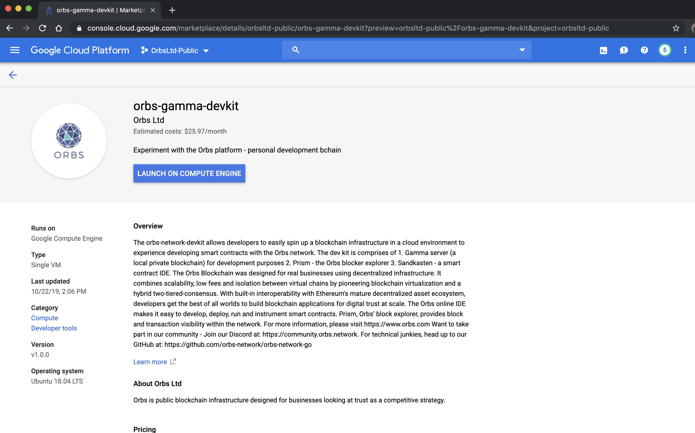

Click "Launch on Compute Engine"

You can take the default settings or customize them.  When complete click "Deploy"

That's it!  Your development kit is now deploying.

## Inspecting the kit once it's running

When the deployment is complete, you should see:

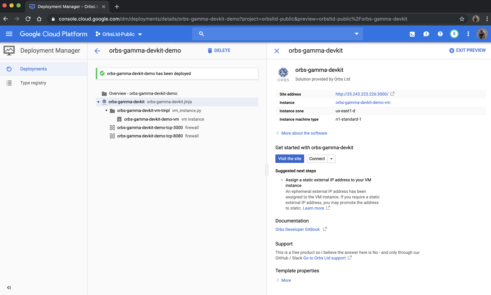

Note: Gamma, the development server, is configured to close a block once every 10 minutes or so, OR when at least 1 transaction is pushed through with an API call. 

At this point, you can open a web browser and view Prism to see block activity. Click on the "Visit the site" button.

Once the browser has finished loading, it should look like:

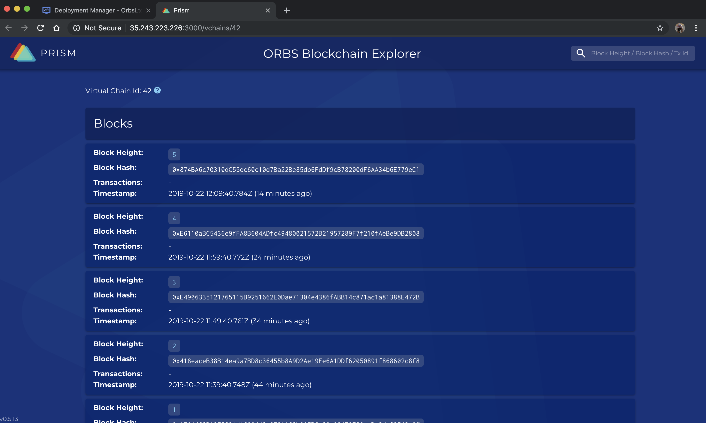

You should see a few blocks. That's great as it shows our development kit is working and closing blocks. 
<!--- I would write - four nodes are working in consensus and closing blocks.... -->
That means we can start to play around with it.

The next kind of interaction we can have with our development kit is to deploy a smart contract into the blockchain and interact with it.

## Developing against the development kit

At the moment Prism and our Blockchain server are running and looks to be closing blocks (which means it's pretty healthy)

Next we will connect to the machine running our Gamma server so that we can use Gamma CLI and deploy our first contract. We'll do so by clicking on "Connect"

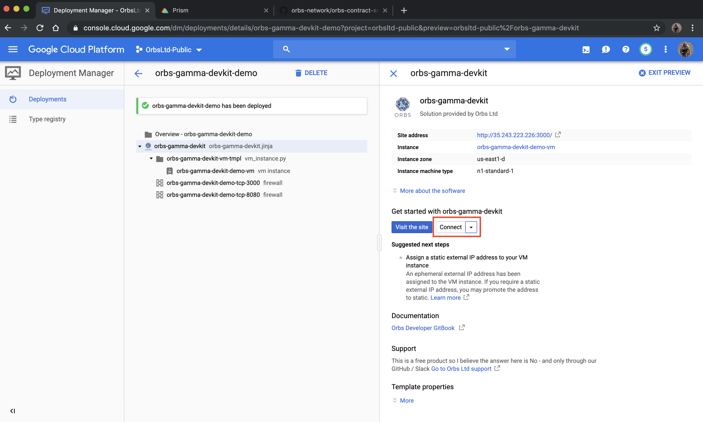

Google Cloud will negotiate the SSH keys between our browser and the target machine and will finish after about 10 seconds. There are of course other means of accessing the machine via SSH. We are merely illustrating the easiest approach here for the sake of keeping things simple.

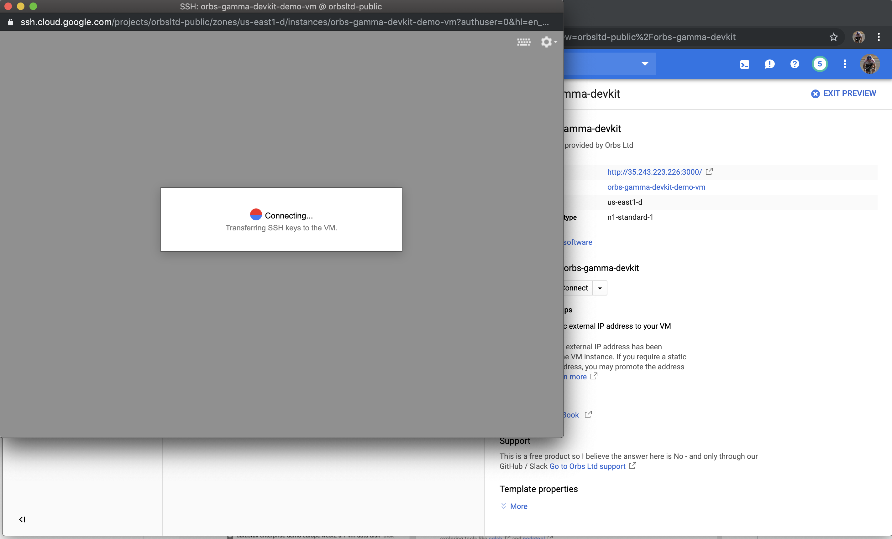

Once inside the machine, our Terminal (which is in a new pop up window) should look like the following:

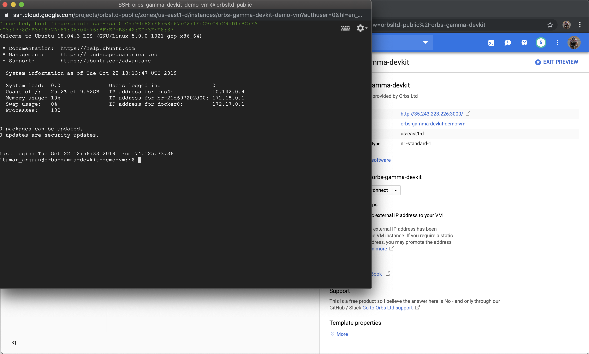

Let's get some example contracts from [Orbs Contract SDK](https://github.com/orbs-network/orbs-contract-sdk) repository by running `git clone https://github.com/orbs-network/orbs-contract-sdk.git` within the terminal window.

(Tip: you might be prompted to approve the authenticity of github.com, simply type `yes` into the terminal when asked)

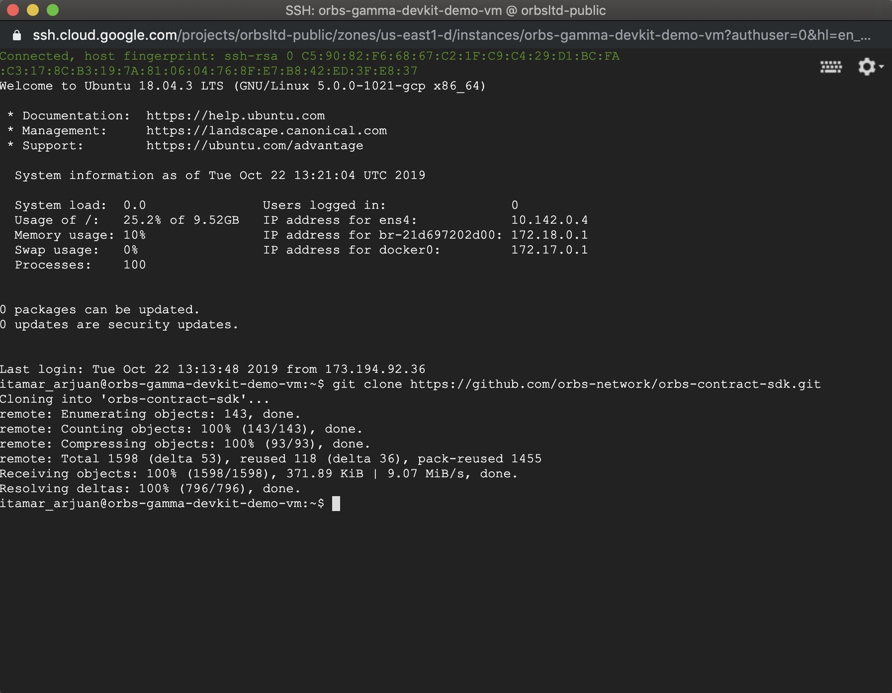

Let's navigate to the examples folder and into the Counter contract by typing `cd orbs-contract-sdk/go/examples/counter/` into the terminal window. The Counter contract is a very simple contract which initializes an empty state variable which we can increment with a call to the `add()` function. In addition we can also access the current counter value by invoking a call to the contract's `get()` function. 

We should now be located inside the folder containg the file `contract.go`. Let's verify this by typing `ls -lh` into the terminal to be sure we can see the file is there.

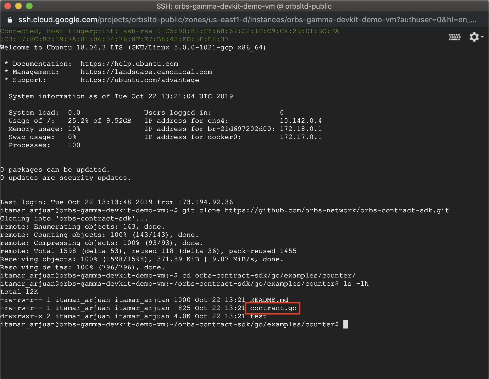

Next we will deploy the contract into our Gamma server by typing the following command: `gamma-cli deploy contract.go -name MyCounter` and wait for it to finish. Once finished, Gamma CLI will return a JSON output object representing the result of our transaction against the server. Which (if all is successful) should look similar to the following

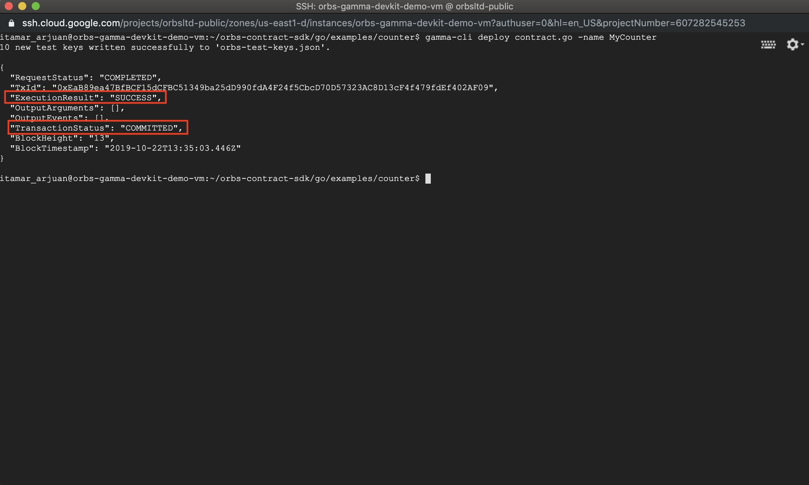

Please note the 2 most important properties for us in the JSON object:

* The `ExecutionResult` provides the most basic kind of proof that the request was successful or not. In this case we can clearly see that the call was successful.
* The `TransactionStatus` is very important. Since this is blockchain we are talking about. Our transaction might have not been committed into any block yet which means it is not final and therfore might be pending (or worse - not accepted at all into the ledger) In our case we can clearly see it's in the `COMMITTED` state so we can rest assure our contract is deployed successfuly!

Congrats! You have successfully deployed your first smart contract! Now how easy is that?!

Ok so what's next? If we look closely at our smart contract code we can see it's initializing the counter value with a value of `0`

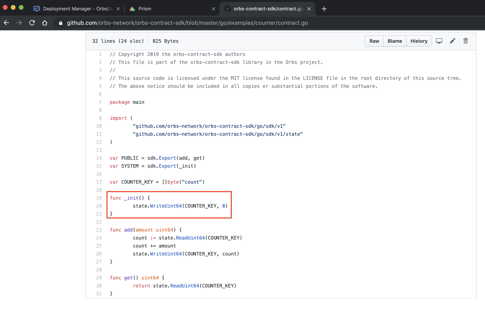

Since our contract is now deployed, let's try and "read" the current value of the counter to make sure we indeed get a `0` back.

Gamma CLI uses a JSON file to represent the action details we're requesting against the blockchain. Our Counter example has such files ready for us to experiment with. Since the `get()` method doesn't really need any arguments, it's request JSON descriptor file is quite easy to reason about. Let's have a look at it:

Let's type into the terminal window `cat json/get.json` (cat is a command in Linux to view the content of a file by printing it)

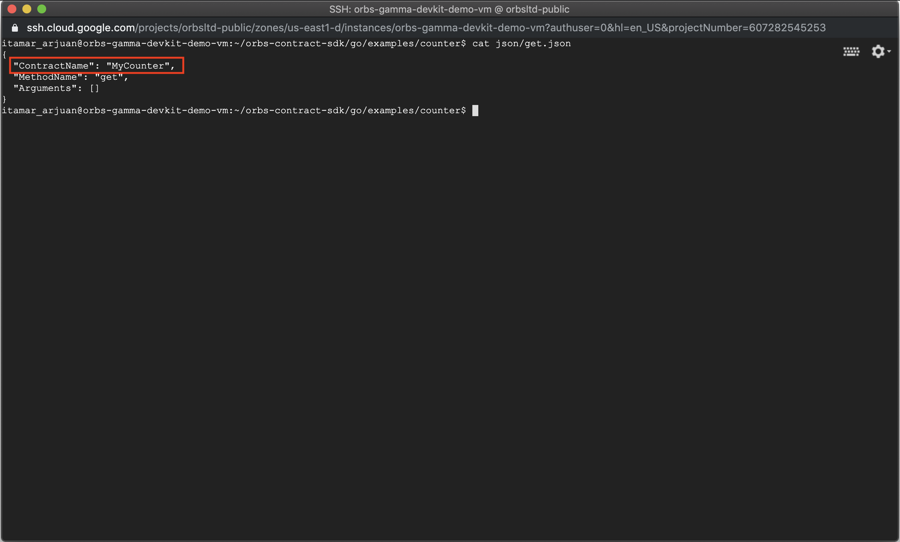

Do note that this file is specifically asking to invoke the `get()` method of the `MyCounter` contract. That name is important as we used it previously to name our contract upon deployment. If you chose a different name you will have to edit this file prior to sending a request with Gamma CLI using this file.

Alright, so now that we have some sense about what gamma is using to send our request to the local blockchain server (Gamma), let's issue a "Query" call and invoke the `get()` command of our contract.

We do that by typing in the terminal `gamma-cli run-query json/get.json`

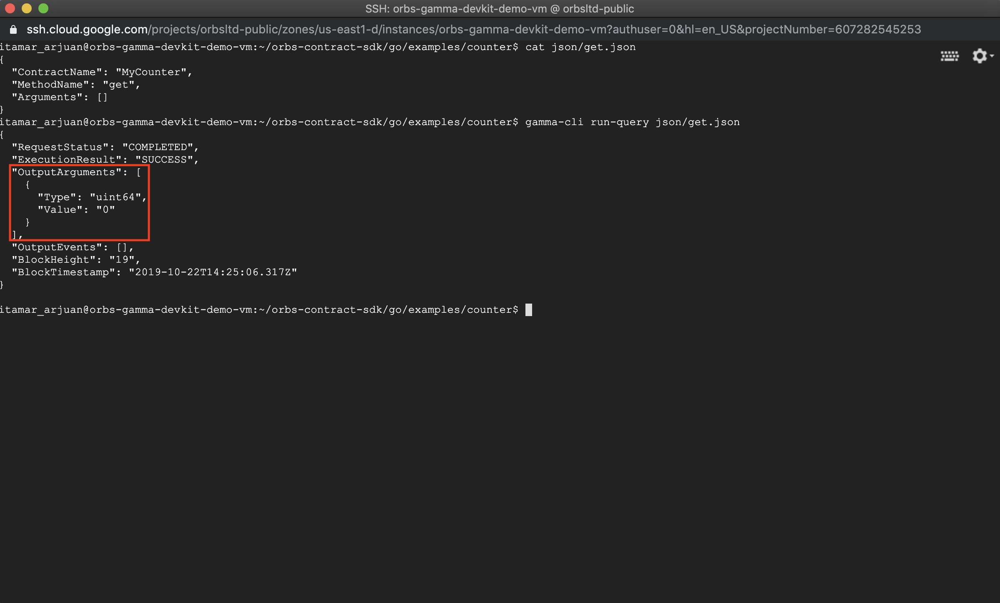

Again, the returned output contains a bit of information. We've highlighted what's most important for us at this stage and that is what is the value of the counter at the moment. We know it's supposed to be 0 but we wanted to verify that. Indeed as it appears by the highlighted red rectangle, the value is a `uint64` (esentially a native number) of `0`

All looks good so far!

Now let's make things intresting by running a transaction that will add '25` to that lonely `0` and make the counter higher!

As before, let's view how the JSON file to describe this action is represented for Gamma CLI to use by typing `cat json/add-25.json`

Notice how we have an argument in this call in the form of a `uint64` (native number) with a value of 25 which will be added to the counter upon running this transaction with Gamma CLI.

In order to make this happen we issue the request with Gamma CLI by typing the following into the terminal
`gamma-cli send-tx json/add-25.json`

and the input from this call should look something similar to the following:

As you can see, the response seems to be successful! We've got again an `ExecutionResult` of `SUCCESS` which is great and means our transaction went through and was also `COMMITTED` into a block which is accepted by the network there being commited to the ledger. So all in all great news! We've actually modified the state of our contract now and updated the counter variable in it's state to represent a different value (25)

Let's verify this is truly the reality by issuing another `get()` call and assert that we actually get 25 and not 0 as before.

Yes!
As expected we can see that the blockchain has returned to us the current value of the counter and it's now standing on 25 instead of the previous 0 that it once was. So everything is working!

## Next Steps

You've probably noticed that we've used `send-tx` and `run-query` on some of these calls. The `send-tx` is used for transactions which aim to change the state of a contract and perform and actual action. Whereas the `run-query` calls are usually "reading" information that is already present and don't require the heavy lifting of the consensus process to occur between the blockchain nodes as happens on a transaction.

To read more about this and learn more about blockchain in general and how to move forward into more complex examples using Orbs be sure to [visit our GitBook](https://orbs.gitbook.io/contract-sdk/)

To learn more about Orbs and it's mission feel free to [visit our website](https://www.orbs.com/)
